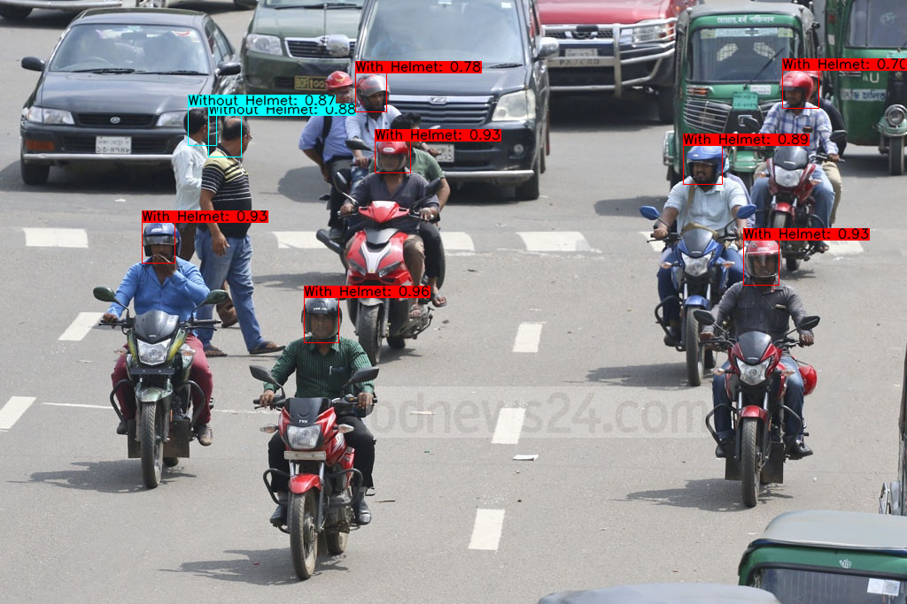
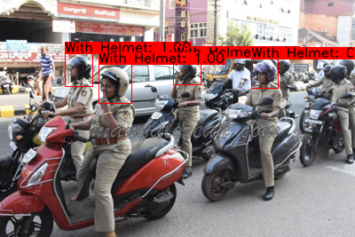
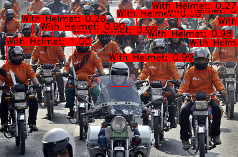

# Helmet-Detection-YOLOv4-tiny
  One of the major causes of serious injuries or death in accidents involving two-wheelers is that the rider was not wearing a helmet. Policemen manually checking whether the riders are using helmets is the only available method employed presently.So there is a need for systems that can be automatically detect whether a rider is wearing helmet or not.
  The AI-based Helmet Detection technology can easily detect people who are without helmets on the road.. It is implemented using Opencv, Python, YOLOv4-tiny .
  
## Result Images

<p align="center"></p>

<p align="center"></p>

<p align="center"></p>

## How to run ?
### Conda (Recommended)

```bash
# Tensorflow CPU
conda env create -f conda-cpu.yml
conda activate yolov4-cpu

# Tensorflow GPU
conda env create -f conda-gpu.yml
conda activate yolov4-gpu
```

### Pip
```bash
## TensorFlow CPU
pip install -r requirements.txt

## TensorFlow GPU
pip install -r requirements-gpu.txt
```

## Run yolov4-tiny tensorflow model
```bash
python detect.py --weights ./checkpoints/yolov4-tiny-416 --size 416 --model yolov4 --images ./data/images/bike1.png --tiny
```
## Run yolov4 on video
```bash
python detect_video.py --weights ./checkpoints/yolov4-tiny-416 --size 416 --model yolov4 --video ./data/video/video.mp4 --output ./detections/results.avi
```
## Run yolov4 on webcam
```bash
python detect_video.py --weights ./checkpoints/yolov4-tiny-416 --size 416 --model yolov4 --video 0 --output ./detections/results.avi --tiny
```


